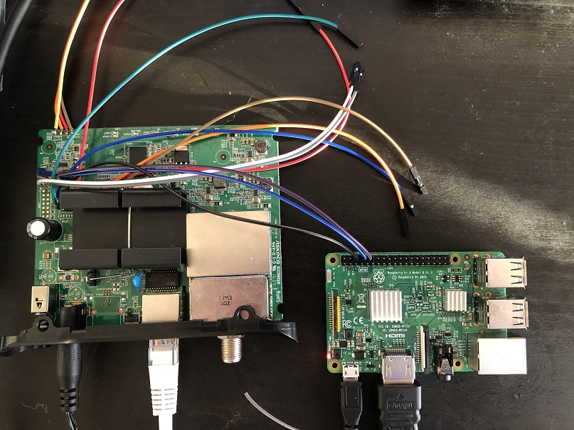
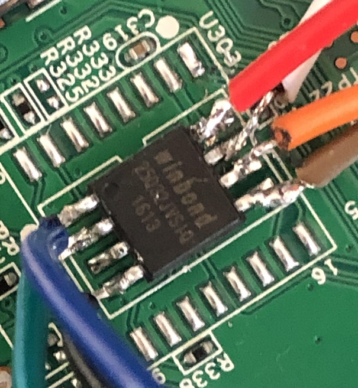
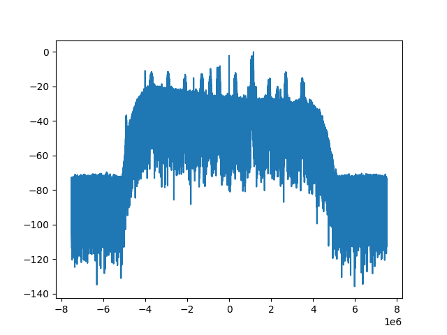
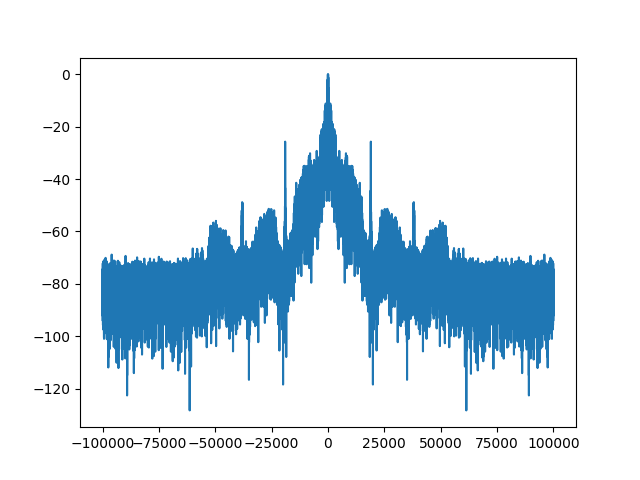

# Reverse engineering my cable modem and turning it into an SDR

 

## Introduction
A few weeks ago I got curious about an old cable modem sitting in my closet,
a Motorola MB7220. Initially I was interested in what kind of hardware it had
and if it was running Linux. Some quick searching brought me to a thread on
a web forum where people were discussing the built in spectrum analyzer feature
used for diagnostics. Someone mentioned that they could see spikes
corresponding to FM radio stations. This sparked a thought: if a cable modem 
and a digital TV tuner dongle are fundamentally doing the same thing (receiving 
and demodulating QAM signals), could a modem be turned into an 
[SDR (software-defined radio)](https://en.wikipedia.org/wiki/Software-defined_radio)
a la [RTL-SDR](https://www.rtl-sdr.com/)?

Going into this project, I knew next to nothing about RF and had no idea if
this goal was even feasible at all for the hardware. I found 
[an SDR project](http://www.hermeslite.com) based on an Analog Devices 
cable modem chip, as well as a [forum thread](https://forums.qrz.com/index.php?threads/cable-modem-to-software-defined-radio-modification-projects.512433/)
where someone else was wondering about the same thing a few years ago.

The last post in the thread from user VK4HAT states:

> I say if you have the skills, time and desire, give it a go and see where you end up. If google shows nothing, then its likely not been tried. With so few firsts available in life, take those that present themselves and have a crack, even if failure is always an option. 

So that is exactly what I did.

## Gaining Access
My first goal was to look for an access vector or a way to communicate with the
device. I knew that there wasn't much to see on the web interface and telnet
was disabled, so I skipped ahead to opening it up.

After removing a few screws from the plastic housing to get access to the
board, my first thought was to look for [UART](https://en.wikipedia.org/wiki/Universal_asynchronous_receiver-transmitter) headers to take a peek at the serial console. 
After identifying two candidates consisting of four vias surrounded by a 
rectangle near the edge of the PCB, it was time to identify the pins. 
Using a multimeter, the ground pin can be easily identified by checking 
the continuity with one of the metal shields on board. The VCC pin can be 
identified by measuring the voltage of each pin when powering on the board. 
It should be a steady 3.3v, or in some cases 1.8v or 5v. This pin is not 
needed, but is still useful to identify the operating voltage and eliminate 
one candidate for the Tx and Rx pins.
While booting, the Tx pin will sit on average a little lower than the VCC pin
and drop much lower when a lot of data is being output. This leaves the last 
pin as Rx.

One of the UARTs identified earlier did not seem to be transmitting anything
while the other did. After soldering some wires to the active UART, I connected
the Tx to UART Rx GPIO pin on a Raspberry Pi, the Rx to the Pi's Tx, and the 
ground to the ground pin. Note that this can only be done because both systems
are 3.3v. Had that not been the case, a USB TTL adapter with an adjustable 
voltage level could be used just as easily, and is probably a better idea most
of the time anyway.

There are a few reasons why the Raspberry Pi is not the best serial interface
such as if you need parity or other features, but in this case I had it on hand
and it works. The serial console of the Pi must also be disabled so that it can 
be freed up for other purposes. There is another reason I chose to use the 
Raspberry Pi which I will get to later.

Finally, to actually see the data I used the `cu` utility:  
`cu -l /dev/serial0 -s 115200`  
The baud rate was a lucky guess, but 115200 is very common on such devices.
If the baud rate is wrong you will quickly know when you see a bunch of garbage
on the screen. A logic analyzer could be used to definitively find the baud 
rate and other parameters, but guessing is sometimes quicker and always 
cheaper.

After powering on the device, the terminal filled with output:

```
pi@raspberrypi:~/modem $ cu -l /dev/serial0 -s 115200
Connected.
�
B3312inim S C 84(9 m
ose_VS 8
STesldlo rh 83 rs 10
STesldhi: _h 8, _s 13
Sync: 0 
MemSize:            128 M
Chip ID:     BCM3383D-B0

BootLoader Version: 2.4.0 fyl spiboot reduced DDR drive avs
Build Date: Nov 12 2015
Build Time: 14:31:43
SPI flash ID 0xef4016, size 4MB, block size 64KB, write buffer 256, flags 0x0
Cust key size 128

Signature/PID: 3383


Image 1 Program Header:
   Signature: 3383
     Control: 0005
   Major Rev: 0003
   Minor Rev: 0000
  Build Time: 2015/11/26 08:47:57 Z
 File Length: 1692841 bytes
Load Address: 80004000
    Filename: ecram_sto.bin
         HCS: e749
         CRC: 175b753f

Found image 1 at offset 20000

Enter '1', '2', or 'p' within 2 seconds or take default...


Performing CRC on Image 1...
CRC time = 282177012
Detected LZMA compressed image... decompressing... 
Target Address: 0x80004000
decompressSpace is 0x8000000
Elapsed time 736066500

Decompressed length: 8091524

Executing Image 1...


 eCos - hal_diag_init
Ecos memory map:
BLOCK    OWNER        MIPS      SIZE      MEM
Block 0: Owner: 0 - 0x00000000 0x07e00000 0x00000000
Block 0: Owner: 0 - 0 MB 126 MB 0 MB
Block 1: Owner: 3 - 0x07e00000 0x00200000 0x07e00000
Block 1: Owner: 3 - 126 MB 2 MB 126 MB
126MB (129024KB) remaining for eCos
Init device '/dev/BrcmTelnetIoDriver'
Init device '/dev/ttydiag'
Init tty channel: 807bb020
Init device '/dev/tty0'
Init tty channel: 807bb040
Init device '/dev/haldiag'
HAL/diag SERIAL init
Init device '/dev/ser0'
BCM 33XX SERIAL init - dev: b4e00500.2
Set output buffer - buf: 0x80852408 len: 4096
Set input buffer - buf: 0x80853408 len: 4096
BCM 33XX SERIAL config
Init device '/dev/ser1'
BCM 33XX SERIAL init - dev: b4e00520.3
Set output buffer - buf: 0x80854408 len: 4096
Set input buffer - buf: 0x80855408 len: 4096
BCM 33XX SERIAL config

Init device '/dev/ser2'
InitBoard: MIPS frequency 637200000

...

Reading Permanent settings from non-vol...
Checksum for permanent settings:  0xe9d88f65
Setting downstream calibration signature to '5.7.1mp1|die temperature:70.775degC'
Settings were read and verified.


Reading Dynamic settings from non-vol...
Checksum for dynamic settings:  0x6e4a329
Settings were read and verified.

Console input has been disabled in non-vol.
Console output has been disabled in non-vol!  Goodbye...
[00:00:00 01/01/1970] [Reset/Standby Switch Thread] BcmResetStandbySwitchThread::ProcessResetSwitchEvent:  (Reset/Standby Switch Thread) Reset switch released; resetting...
[00:00:00 01/01/1970] [Reset/Standby Switch Thread] BcmResetStandbySwitchThread::ProcessResetSwitchEvent:  (Reset/Standby Switch Thread) Cant Reset pfCmDocsisCtlThread==NULL...
```

This output contains a wealth of information. The device is 
running [eCos](https://en.wikipedia.org/wiki/ECos) on a MIPS processor 
which is part of a Broadcom BCM3383 SoC. It turns out there are actually
two MIPS processors on this SoC although one of them is not used on this
modem, explaining the other UART. On some devices, the second processor
will run Linux for additional features.

Also, this seems like the end of the line for serial because shortly after 
booting the actual OS, it disables the serial console. Hitting "p" at the 
bootloader prompt does not lead to much except a way to download new OS 
images via tftp and a utility to read and write memory addresses. This could
be used to bypass the check, but a much greater understanding of the OS and
memory layout would be required.

## Dumping the flash

My goal now was to enable the serial console. Examination of the board reveals
a single [SPI](https://en.wikipedia.org/wiki/Serial_Peripheral_Interface) flash
chip which likely contains the bootloader, OS, and configuration as it is the
only non-volatile storage visible on the board.

This is where the Raspberry Pi comes in handy once again. The GPIO header also
conveniently contains a SPI interface which can be used to read the data off
of the flash chip.

Searching the number on the chip, "winbond 25Q32JV", yields the datasheet
containing the pinout. The important ones are VCC, Chip Select (CS), Clock
(CLK), Data Out (DO), Data In (DI), and ground.

One common issue with dumping a SPI chip on a board is that the chip requires
power, but this will also usually power the board and cause it to start booting
and using the chip. I chose to overcome this by heating the VCC pin with my
soldering iron and very carefully lifting it off the pad. This is a convenient,
but rather crude solution which may result in snapped off leads so use at your
own risk! I also soldered a jumper wire to the pad and another to the floating
leg so that I could easily connect and disconnect them and allow the device to
boot again.

Another note, on some boards the Chip Select pin is assumed to always be 
enabled so it is directly tied to VCC. This means when you power the CS 
pin, the board also starts booting. This can be solved in a similar way
to the VCC pin.

Now, wires can be soldered to the rest of the pins and the they can be
connected to the Raspberry Pi. The ground goes to ground (the UART ground
from earlier can also be used), the VCC to the Pi's 3.3v pin. (Again, it is
critical to verify with the datasheet that this is a 3.3v chip because the Pi
only supports 3.3v). The DO pin is connected to the Pi's SPI `MISO` (master in 
slave out) pin and DI to the `MOSI` pin (master out slave in). Lastly, the 
Clock is connected to the `SCLK` GPIO pin and the Chip Select to the `CE0` pin.

|  |
|:--:|
| *Not the best soldering job but it will work* |


To actually read the chip, there is a fantastic tool called 
[flashrom](https://flashrom.org/Flashrom) which supports an enormous number of
chips. `flashrom` is present in the repos of many distributions including that
of the Raspberry Pi OS (formerly known as Raspbian).

Luckily the W25Q32JV is supported, under the name "W25Q32.V". A quick check on
the flashrom wiki shows the size and voltage match what is expected and that
the chip is fully supported.

Before proceeding, ensure that the SPI interface on the Pi is enabled by
using the `raspi-config` utility and checking under "Interfacing Options".

At last we can read the chip. First verify that it is detected and everything is
wired correctly:
```
flashrom -p linux_spi:dev=/dev/spidev0.0,spispeed=2000 \
    --chip W25Q32.V
``` 

If that succeeds we can now dump the contents:
```
flashrom -p linux_spi:dev=/dev/spidev0.0,spispeed=2000 \
    --chip W25Q32.V \
    --read modem.bin
```

## Firmware Analysis

A quick glance at the hexdump reveals that most of the data is compressed or
encrypted but near the end, the configuration is visible.

```
...
003f00c0: ffff ffff ffff ffff ffff 0000 07b0 369a  ..............6.
003f00d0: 6336 0010 434d 4170 0002 0000 0002 0000  c6..CMAp........
003f00e0: 0000 0057 4d4c 6f67 0005 0004 7573 6572  ...WMLog....user
003f00f0: 0004 7573 6572 0005 6164 6d69 6e00 086d  ..user..admin..m
003f0100: 6f74 6f72 6f6c 6102 7465 6368 6e69 6369  otorola.technici
...
```

The web interface credentials are plainly visible as well as many other
encoded configuration values.

After some searching, I came across a great project called 
[bcm2-utils](https://github.com/jclehner/bcm2-utils) which contains utilities
to dump, parse, and modify the configuration on Broadcom cable modems. The repo
also contains a lot of very detailed documentation on the format of the
firmware and configuration. As a quick note, the dumping feature requires 
either telnet or serial connection, neither of which were available on my device.

The start of the configuration is actually at 0x003f0000 on my device and
includes the 202 0xff bytes. After extracting just the config from the dump,
I was able to successfully read it with `bcm2cfg`.

I enabled the serial console as well as telnet access and set a simpler telnet
password.

```
$ ./bcm2-utils/bcm2cfg set bfc.serial_console_mode "rw"
bfc.serial_console_mode = rw
$ ./bcm2-utils/bcm2cfg set userif.remote_acc_methods 0x3
userif.remote_acc_methods = http | telnet
$ ./bcm2-utils/bcm2cfg set userif.remote_acc_pass abcd
userif.remote_acc_pass = abcd
```

Next, I appended the modified configuration onto a file padded with zeros up
to the appropriate offset and used `flashrom` to write the configuration back
to the chip.
 
To avoid rewriting the entire chip, I created a layout file for `flashrom` so it
would only overwrite the configuration rather than the entire contents which is
why the modified image is just padded with zeros.
The layout file looks like this:
```
00000000:003effff fw
003f0000:003fffff cfg
```
and the command:
```
flashrom -p linux_spi:dev=/dev/spidev0.0,spispeed=2000 \
    --chip W25Q32.V \
    --layout ./layout \
    --image cfg \
    --write modem-modified.bin
```

After opening the serial console and booting again, I am greeted with... the 
exact same thing as before.

Closer examination of the flash image shows that there are a number of
repeated copies of the configuration following the initial one. These have
slight differences, the most obvious being additional error log messages. It 
appears that the device keeps rolling backups of the configuration in case 
one gets corrupted. 

To simplify things, I did a factory reset through the web interface to get rid
of all the error log messages. Then I dumped the flash again and repeated the 
previous process to modify the clean configuration except this time I truncated
the config to only include the first copy. Then using some `dd` commands I
would rather not think about, I reconstructed the entire configuration section,
appending the modified config at each offset where a copy of the config
started.

After flashing this new image and booting once again, I am finally able to
view the entire boot log and then have access to a console, although the
output is being flooded by a process looking for a signal.
```
...

Reading Permanent settings from non-vol...
Checksum for permanent settings:  0xe9d88f65
Setting downstream calibration signature to '5.7.1mp1|die temperature:70.775degC^@^@^@^@^@'
Settings were read and verified.


Reading Dynamic settings from non-vol...
Checksum for dynamic settings:  0x2630e508
Settings were read and verified.

[00:00:00 01/01/1970] [tStartup] BcmBfcFpmDriver::Init:  (BFC FPM Driver) Setting FPM Buffer size to: 256 Base Address: 0x87566600
[00:00:00 01/01/1970] [tStartup] BcmBfcFpmDriver::Init:  (BFC FPM Driver) fFpmLargestBufferSize: 2048 fFpmSizeShiftBits: 0x8
[00:00:00 01/01/1970] [tStartup] BcmBfcFpmDriver::Init:  (BFC FPM Driver) Pool index: 0  pool size: 2048
[00:00:00 01/01/1970] [tStartup] BcmBfcFpmDriver::Init:  (BFC FPM Driver) Pool index: 1  pool size: 1024
[00:00:00 01/01/1970] [tStartup] BcmBfcFpmDriver::Init:  (BFC FPM Driver) Pool index: 2  pool size: 512
[00:00:00 01/01/1970] [tStartup] BcmBfcFpmDriver::Init:  (BFC FPM Driver) Pool index: 3  pool size: 256
[00:00:00 01/01/1970] [tStartup] BcmBfcFpmDriver::Init:  (BFC FPM Driver) Lookup table index: 0  pool size: 3

...

[00:00:18 01/01/1970] [Scan Downstream Thread] BcmGenericCmDownstreamScanThread::ThreadMain:  (Scan Downstream Thread) Scanning for a Downstream Channel...
[00:00:18 01/01/1970] [Scan Downstream Thread] BcmGenericCmDownstreamScanThread::ScanStarting:  (Scan Downstream Thread) Scanning STD & HRC Annex B channel plan frequencies
Resetting EnergyDetected to false.
Forgetting energy frequency.
Executing fast scan algorithm...

Type 'help' or '?' for a list of commands...

CM> Scanned 489000000 Hz...
Scanned 495000000 Hz...
Scanned 501000000 Hz...
Scanned 507000000 Hz...
Scanned 513000000 Hz...
``` 

## eCos Console
The eCos console contains many configuration and debugging commands. The
process flodding the output can be stopped with the following commands:
```
cd cm_hal
scan_stop
```

As a side note, these "directories" are not a real filesystem, they are just a
way of organizing groups of commands.

Telnet access also works at the IP address `192.168.100.1`. The username is
"technician" and the password is what I changed it to earlier when modifying
the configuration. Telnet puts you into a limited version of the shell, but
the full shell can be accessed with the `su` command and the password `brcm`
when prompted (credit to jclehner, author of bcm2-utils for that one). This
password may vary depending on the device manufacturer.

Initially, I just wanted to see if I could enable the web-based spectrum
analyzer which seems to be disabled on this device. There were some settings
related to it, but nothing about enabling or disabling the external interface.

After spending several hours poking around in the various menus and commands
I decided it was time to move on to analyzing OS.

## Reverse engineering the firmware
Thanks to the boot log, we know the OS is located at 0x20000 and is LZMA
compressed.

The README of `bcm2-utils` pointed me to a 
[Broadcom repo](https://github.com/Broadcom/aeolus/tree/master/ProgramStore) 
containing a utility called `ProgramStore` for extracting the OS image.

After building `ProgramStore` I was able to extract the decompressed image with
the following command:
```
./ProgramStore -f ./ecram_sto.bin -o decompressed_fw.bin -c 4 -x
```

Now we can throw it into [Ghidra](https://ghidra-sre.org/) using the base 
address from the boot log, 0x80004000 and setting the architecture to 
big endian MIPS.

After running the auto analysis it's time to start digging around. Fortunately,
there a lot of debug strings that makes some functions very easy to identify.

I started naming any functions I came across using the strings as well as
the function signature in combination with the context it is used and any
cross references. Eventually, when ending up in an unknown function, the cross
references to named functions give some clue as to the context of the function
eventually making things a little easier.

For the most part, I was just searching interesting strings such as "tuner" and
"ADC" and trying to understand as much as I could, going wherever the various
function calls took me and keeping notes on interesting functions, structures, 
addresses, and theories for how things worked in a separate text document.

One useful feature of the eCos console is the `call` command which allows you
to call a function at an arbitrary address with the the given arguments. This
allows us to actually execute a function to test a hypothesis about what it
does.

The operating system has a large amount of Broadcom code on top of it which is 
all written in C++. This makes reversing it significantly more annoying by
adding a lot of indirection when it comes to function calls and polymorphism.
For example you will often see code like this:
```
case 0x24:
    uVar23 = (**(code **)(*piParm1_00 + 0x1c))(piParm1_00);
```
Not only does this make the code very hard to follow, it also means Ghidra 
cannot track cross references to functions that are called in this way.

Sometimes the class can be determined by following the object pointer all the
way back to where it is initialized, but other times it is easier to just patch
a function where the unknown object is used to write the vale of the pointer 
to a known location and then return. This can be done with the `write_memory` 
command in the eCos console. Then the `call` command can be used to call the 
function containing the unknown object and then `read_memory` can be used to 
retrieve the pointer from the known location. These type of hacks as well as
combining static and dynamic analysis are crucial to avoid getting stuck.

Some functions would cause the device to crash when I tried to call them.
Closer inspection shows they are taking more than 4 arguments and using the
t0, t1, t2, and t3 registers for the additional arguments. This is a little
unusual for a 32-bit MIPS device, but as it turns out the calling convention
is determined by the ABI and MIPS has a number of different ABIs. It is
suprisingly hard to find information about the exact calling conventions, but
using [Godbolt](https://godbolt.org/), I was able to determine that EABI is
the most likely candidate which uses t0-t3 for additional arguments.
Unfortunately, Ghidra does not seem to support MIPS EABI, but manually setting
the argument registers on a few functions is not too inconvenient and the
arguments seem to be the only consequential difference.

After digging around for a while, I set my sights on the spectrum analyzer. I
was never able to figure out how to enable the web interface, although the
code for it was there.

I found many other useful functions such as those used to set the frequency
of a downstream (recieving) channel, the socket/bind/listen/send/recv
functions, thread creation functions, and functions for reading and writing
to registers of tuner and LNA (low noise amplifier).

## Breakthrough
Eventually I found a console command to perform a bandpower measurement for a
given frequency range.

I began closely following the execution to see what it does
with the frequency range arguments and found that it calls a very
familiar function - almost identical to the one used to tune downstream
channels, but the memory mapped register addresses where the frequency is set
are just above those used for normal channels. This suggests that the spectrum
analyzer uses an extra channel that otherwise operates in a very similar way
to the normal downstream channels with regards to tuning and setting the gain.

Continuing on, the measurement function writes the physical address of a
destination buffer to a memory mapped register and then sets a bit in another 
register and loops until it is unset again. Then it calls the function that 
presumably computes an FFT, passing in buffer address. After the computation, 
another function does some processing on the buffer, but leaves it otherwise 
intact.

After sticking a jumper wire into the coaxial connector to act as as an 
antenna, I called the bandpower function and then did a `read_memory` on the 
destination buffer.

```
CM> read_memory -n256 0x86fb3e80

86fb3e80: 00 00 06 8c  00 3f fe 48  00 00 06 41  00 20 00 3d | .....?.H...A. .=
86fb3e90: 00 00 08 56  00 20 02 11  00 00 0a b3  00 20 03 f2 | ...V. ....... ..
86fb3ea0: 00 00 0a 50  00 20 04 84  00 00 06 61  00 20 03 d7 | ...P. .....a. ..
86fb3eb0: 00 00 01 1d  00 20 02 da  00 1f fd f4  00 20 00 4d | ..... ....... .M
86fb3ec0: 00 1f fd 11  00 3f fc 20  00 1f fb 95  00 3f fa ad | .....?. .....?..
86fb3ed0: 00 1f fa 32  00 3f fd fc  00 1f fc a3  00 20 00 cb | ...2.?....... ..
86fb3ee0: 00 00 01 97  00 3f fe b5  00 00 04 0f  00 3f fb 6a | .....?.......?.j
86fb3ef0: 00 00 03 9f  00 3f fb d6  00 00 03 1d  00 3f fe 55 | .....?.......?.U
86fb3f00: 00 00 02 f8  00 3f ff a9  00 00 02 ee  00 20 01 49 | .....?....... .I
86fb3f10: 00 00 03 8f  00 20 04 87  00 00 03 94  00 20 05 09 | ..... ....... ..
86fb3f20: 00 00 01 81  00 3f ff bb  00 1f ff 14  00 3f fa 97 | .....?.......?..
86fb3f30: 00 1f fe 8d  00 3f fc 9d  00 1f ff 89  00 20 01 82 | .....?....... ..
86fb3f40: 00 00 00 be  00 20 00 09  00 00 01 8f  00 3f fa 3a | ..... .......?.:
86fb3f50: 00 00 01 78  00 3f fa 66  00 00 00 7b  00 20 01 35 | ...x.?.f...{. .5
86fb3f60: 00 1f ff 79  00 20 04 f6  00 1f fe e2  00 20 02 62 | ...y. ....... .b
86fb3f70: 00 1f fd 93  00 3f ff 4d  00 1f fa ee  00 3f fe 16 | .....?.M.....?..
```

My hope was that this was [I/Q](http://www.ni.com/tutorial/4805/en/) data and 
this certainly looked promising. This was supported by the function that 
processes the data after the FFT - it checks if the 0x00200000 bit is zero on 
the first 32-bit word, and if so drops the first and last word of data. 
I hypothesized that this bit indicates if the sample is an I or a Q value, and 
if the first sample is a Q, it drops the unmatched Q from
the beginning and unmatched I from the end. For example:
```
Case 1:                Case 2:
Q IQ IQ IQ I           IQ IQ IQ IQ

     |                      | do nothing
     v                      v

  IQ IQ IQ             IQ IQ IQ IQ
```

The only way to know for sure was to grab some more data and analyze it.

## Hello World
To make things easier going forward, I decided to write a program that would
run on the modem to call the tune and bandpower functions, and then open a 
listening sock and send the contents of the buffer back over a TCP connection. 
I should  also note I stopped working on the Raspberry Pi at this point so 
that I would not have to create an ARM-to-MIPS crosscompiler.

The basic approach to write code that can be loaded and executed on
"almost-bare metal" is as follows.

By adding the signatures of the external functions we wish to use to a header
file and using a linker script containing the addresses of the functions, it 
is easy to compile a program that utilizes these functions. Additionally, to 
make the program work when loaded at a predetermined memory location and 
ensure the entry point is at that address, a section map is be used. 
The linker script looks something like this:
```
memset = 0x80522d7c;
memcpy = 0x80004f30;
malloc = 0x80596998;
printf = 0x8052b178;
socket = 0x80332fd0;
bind = 0x800ae7bc;
listen = 0x80412ed4;
accept = 0x80413118;
send = 0x80413240;
recv = 0x804134bc;
tune_aux_channel = 0x80082108;

SECTIONS
{
  . = 0x80810000;
  .start : { *(.start) }
  .text : { *(.text) }
  .data : { *(.data) }
  .rodata : { *(.rodata) }
}
```

It is built with the following command: 
```
mips-linux-gcc measure.c \
    -march=mips32 \
    -mabi=eabi \
    -msoft-float \
    -mno-abicalls \
    -fno-builtin 
    -nostdlib \
    -nodefaultlibs \
    -nostartfiles \
    -T ./script.ld
```

The MIPS CPU does not have an FPU so `-msoft-float` is used. `-mno-abicalls`
seems to be required when using `-mabi=eabi`. `-fno-builtin` prevents the
compiler from optimizing certain sections by adding calls to functions like
`memcpy` which would result in an undefined symbol. `-nostdlib` and 
`-nostartfiles` prevent the compiler from using the standard c library the 
"crt0.o" entrypoint which does some setup we do not care about.

Using `objcopy` we can extract just the sections we care about out of the
compiled elf.
```
mips-linux-objcopy -O binary \
    -j .start \
    -j .text \
    -j .data \
    -j .rodata \
    a.out bin
```

And finally, to actually load it I wrote a Python script that uses pexpect to
telnet into the modem and write the binary to the target address using the 
`write_memory` command. The program is executed with the `call` command.

To see if I could pick up FM radio broadcasts, I tuned it to 100MHz and
grabbed some data.

Using the numpy, scipy, and matplotlib Python libraries, I was able to
interpret the data a complex valued samples, compute an FFT and plot it to
see a nice band pass filtered spectrum with distinct spikes.

|  |
|:--:|
| *The plotted frequency spectrum* |

At the time I was still not really convinced, but in retrospect this really
does demonstrate that I had successfully captured complex samples as such a
plot would not be possible with the my script were that not the case.

I was not going to be fully convinced until I could demodulate the signal and
listen to the FM radio broadcasts. Shifting the spectrum to center one of the 
spikes, decimating it to isolate the frequency range, and using a very simple 
demodulation technique I found online for complex-valued FM, I was able to 
clearly see the different parts of the broadcast including the (what should be)
19kHz pilot tone.

|  |
|:--:|
| *The frequency spectrum of the demodulated signal* |

With some experimentation, I determined that a sample rate of 15 million samples
per second puts the pilot tone right at 19kHz. This seems consistent with the 
fact that the bandpower function measures in blocks of 7.5MHz. Although you get 
a full 15MHz since these are complex-valued samples, the usable range of the 
band pass filter is more like 7.5-8MHz with an assumed 15MHz sample rate which 
matches up.

## Optimizations
At 15 million samples per second and each sample with occupying 8 bytes, 
less than a second of data can be stored in the approximately 100MB of free 
RAM.

One obvious improvement would be to send the data after filling the buffer and
then capture more data. The processing time and network throughput meant that
there was about an 11 second gap between captures. This was cut down to about 5
seconds by implementing a new function that sets up the registers and initiates
the capture, eliminating the FFT calculation and other processing.

After some experimentation with the unknown register values in hopes of finding
one that would affect the sample rate, I found a bit that appears to limit the 
I and Q values to 14 significant bits. While they were still occupying 8 bytes 
per sample, this meant I could pack two of them into a single 32-bit word.  
Note: I am not sure the ADC is actually sampling 14 / 20 bits as that seems
rather high, but that is the effective size of each sample value.

I wrote another function to process each capture, determine if it starts
with an I or a Q value and then iterate through the buffer packing each 
I/Q pair into a single integer and writing it to the next position in the 
buffer. This alone did not improve the performance much, but by only taking 
every Nth sample, I could lower the effective sample rate, shorten the 
processing time, and reduce the number of bytes I had to send back which
greatly improved the latency.

Another improvement was threading. I found the functions used to create and
start new threads as well as those used for counting semaphores on the OS 
thanks to some debug messages. With these tools, I could have two or more 
buffers. Then one thread continuously captures data into the next available
buffer and then signals another thread with a semaphore that it is done 
writing. The second thread packs and downsamples the data, sends it over the 
network, and then signals that the buffer is available to be written to again.

With these improvements and the sample rate reduced by a factor of 32 (down to
464kHz), I could endlessly capture and send data while dropping about 12%. I
believe this is mostly due to a few milliseconds of inherent latency between
when the capture is finished and the "done" flag is set. Additionally, I do
not know if there is a way to generate an interrupt or something when it
finishes so I have to restort to sleeping in a while loop since that is how it
is done in the original function.

My hope is that there is some sort of clock divider register to reduce the
clock of the ADC to lower the sample rate which may reduce this latancy and
eliminate postprocessing time, but I have not yet found one.

Downsampling this way seems to lose a lot of the information - past about 16 
times the noise floor is a lot higher and the stereo channels of FM radio 
broadcasts are no longer discernable.

Although dropping some data is bad some some applications, it can stream FM 
radio fairly seamlessly, although the audio has to be slowed down slightly 
so it is not consumed faster than it is being recieved. I have also been able 
to be recieved. I have also been able to pick up the 154MHz narrowband FM radio
used by the local fire department. 

[Here is a short sample of some demodulated audio captured with the modem](./img/sample.wav)

## Conclusion

Although this project was mostly just a challenge to myself and is not intended
as a serious SDR, I am satisfied with the results and hope to continue to 
improve it.

This quote really resonated with me, so once again in the words of VK4HAT, "With so few firsts available in life, take those that present themselves and have a crack"

[cm-sdr repo on GitHub](https://github.com/stdw/cm-sdr)
